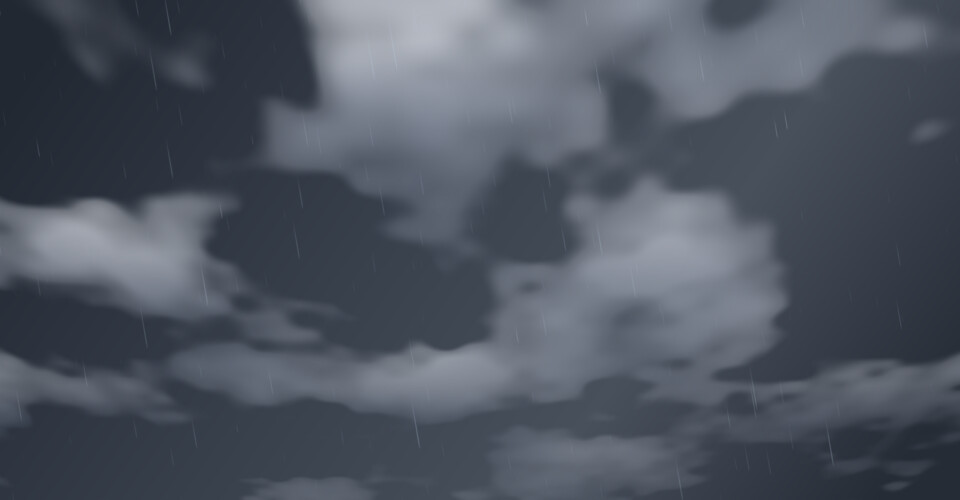
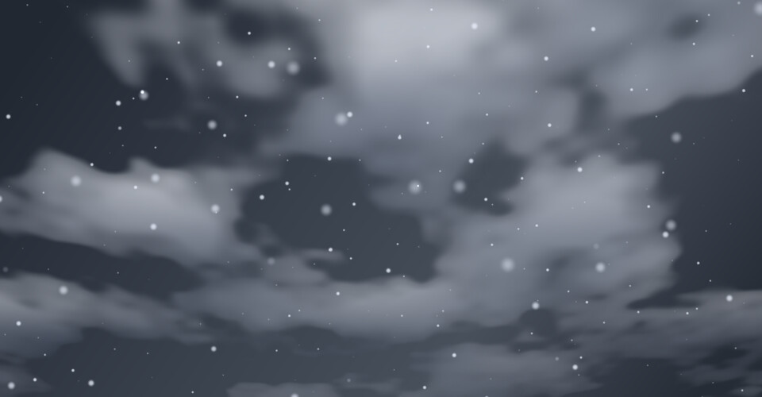
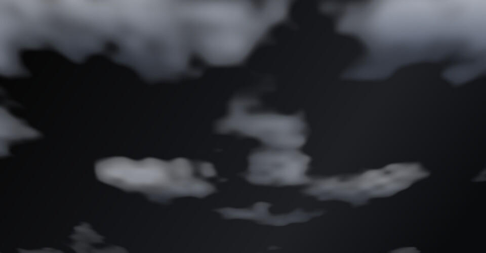
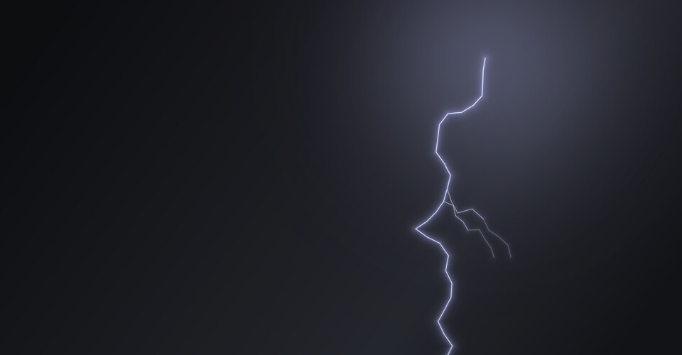
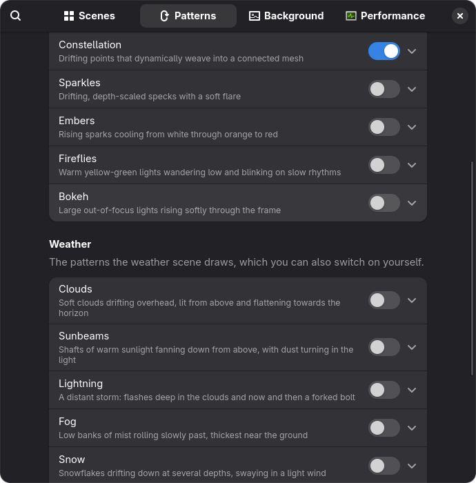

<div align="center">

# Wallpaper FX

**Animated wallpapers for GNOME, drawn by your GPU.**

Aurora, nebulae, starfields, every kind of weather and more: sixteen patterns you can stack,
painted straight onto the desktop behind your windows, or chosen for you by the weather
outside.<br>
No extra window, no video file, and next to no CPU.


<sub>*Deep Space*: nebula clouds, a starfield and drifting constellations, with a meteor on its way through.</sub>

</div>

## Weather

Turn on **Follow the Weather** and the desktop shows the weather where you are:
rain when it's raining there, fog in fog, snow, a thunderstorm with lightning,
or a clear starry night. The sky follows the time of day from dawn to dusk,
worked out from where the sun is, so it moves on between reports and without a
network. Wind speeds up the clouds and the rain.

<table>
  <tr>
    <td align="center" width="33%"><br><b>Clear day</b></td>
    <td align="center" width="33%"><br><b>Scattered cloud</b></td>
    <td align="center" width="33%"><br><b>Dawn</b></td>
  </tr>
  <tr>
    <td align="center"><br><b>Clear night</b></td>
    <td align="center"><br><b>Light rain</b></td>
    <td align="center"><br><b>Snow</b></td>
  </tr>
</table>

It finds where you are with GNOME's Location Services, if you let it, or uses a
town you choose in the settings. The weather comes from the same place as GNOME's
own: [GWeather](https://gitlab.gnome.org/GNOME/libgweather), which asks the
nearest airport's weather station what it sees now, and MET Norway for the
coming hour where there is no station. It checks again every half hour.

While the weather is choosing, your own patterns and background are kept as they
are, and come back when you turn it off. Turn off **Weather Sets the Sky** to keep
your own background under the weather's patterns.

> [!NOTE]
> **Privacy.** Following the weather sends the coordinates of the nearest town
> in GWeather's list, never your exact position, to MET Norway
> (api.met.no), and that town's station code to NOAA's Aviation Weather Center
> (aviationweather.gov). Nothing is sent while it is off. The town and the last
> report are kept in the extension's settings until you turn it off.

### Your scenes

Set up a look on the Patterns and Background pages and save it as a scene, to
come back to in one click. Choosing a scene stops following the weather.

## Patterns

Sixteen patterns, and you can turn on any combination of them. Each one is shown
here by itself, over a palette it suits. Some are cropped in
close, and Starfield, Sparkles and Embers have their Amount and Brightness turned
up so they're visible at this size.

<table>
  <tr>
    <td align="center" width="33%"><br><b>Nebula</b><br><sub>Slow clouds of violet, teal and magenta light</sub></td>
    <td align="center" width="33%"><br><b>Aurora</b><br><sub>Curtains of polar light, streaked with rays</sub></td>
    <td align="center" width="33%"><br><b>Contours</b><br><sub>Topographic lines of a slowly shifting landscape</sub></td>
  </tr>
  <tr>
    <td align="center"><br><b>Starfield</b><br><sub>Layered stars, a galactic band and meteors</sub></td>
    <td align="center"><br><b>Wave</b><br><sub>Folded sheets of light with bright crests</sub></td>
    <td align="center"><br><b>Constellation</b><br><sub>Drifting points that link up when they meet</sub></td>
  </tr>
  <tr>
    <td align="center"><br><b>Sparkles</b><br><sub>Drifting, depth-scaled specks with a soft flare</sub></td>
    <td align="center"><br><b>Embers</b><br><sub>Sparks rising and cooling from white to red</sub></td>
    <td align="center"><br><b>Fireflies</b><br><sub>Warm lights wandering and blinking slowly</sub></td>
  </tr>
  <tr>
    <td align="center"><br><b>Bokeh</b><br><sub>Out-of-focus lights rising and fading</sub></td>
    <td align="center"><br><b>Clouds</b><br><sub>Soft clouds drifting overhead, lit from above</sub></td>
    <td align="center"><br><b>Sunbeams</b><br><sub>Shafts of warm light, with dust turning in them</sub></td>
  </tr>
  <tr>
    <td align="center"><br><b>Lightning</b><br><sub>Flashes in the clouds and forked bolts</sub></td>
    <td align="center"><br><b>Fog</b><br><sub>Low banks of mist rolling slowly past</sub></td>
    <td align="center"><br><b>Snow</b><br><sub>Flakes at several depths, swaying in the wind</sub></td>
  </tr>
  <tr>
    <td align="center"><br><b>Rain</b><br><sub>Fine slanted streaks, the near drops faster</sub></td>
  </tr>
</table>

## Features



- **Stack any patterns and tune each one.** Every pattern has its own brightness
  and speed, and most let you set how much of it there is. Overall speed and
  opacity apply on top.
- **Any base.** Use your own wallpaper, a gradient in GNOME's accent colour, one
  of eleven palettes, or any picture.
- **It shows up wherever your wallpaper does.** That includes the overview, the
  workspace switcher, and extensions that blur the background.
- **Built for multiple monitors.** Each monitor runs at its own refresh rate,
  or you can span one picture across all of them.
- **Light on the machine.** On a GTX 1080 at 1080p, each pattern takes 0.1–0.65 ms
  of GPU time per frame, and the whole thing uses about 4% of one CPU core.
  It uses nothing at all while windows cover the desktop, in power-saver mode,
  with animations turned off, or on battery if you choose.

<br clear="right">

## Install

It isn't on extensions.gnome.org yet, so install it from source. You need
GNOME Shell 45–50, `make`, and `glib-compile-schemas` (which comes with GLib).

```bash
git clone https://github.com/Jackicus/GNOME-Wallpaper-FX.git
cd GNOME-Wallpaper-FX
make install
```

GNOME Shell only looks for new extensions when you log in. Log out, log back in,
then turn it on:

```bash
gnome-extensions enable wallpaper-fx@jackicus
```

To choose patterns or follow the weather, open the settings in the Extensions
app, or run `gnome-extensions prefs wallpaper-fx@jackicus`.

To update, run `git pull && make install`, then log out and back in. To remove
it, run `make uninstall`.

> [!NOTE]
> It has been built and tested on GNOME Shell 50. Versions 45–49 are listed as
> supported but haven't been tested yet. GNOME 51 dropped the effect that draws
> the patterns, so it needs a port. See [docs/compatibility.md](docs/compatibility.md).

## Development

```bash
make link      # install as links into src/, for development
make reload    # apply your edits to the running shell, no logout needed
make nested    # start a throwaway nested GNOME Shell, mirrored in a window
make check     # compile every pattern's shader offline
make bench     # time each pattern on your GPU
```

A pattern is a single GLSL function plus one line in `src/lib/catalog.js`.
[docs/patterns.md](docs/patterns.md) explains how to write one and what keeps it
cheap. The rest of [`docs/`](docs/) covers the shell internals the extension
depends on, compatibility, and publishing.

## Licence

GPL-2.0-or-later. See [LICENSE](LICENSE).
