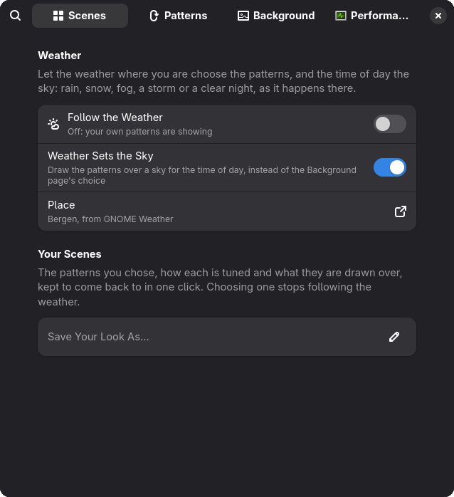

# Wallpaper FX

Animated wallpapers drawn by your GPU: aurora, nebulae, starfields, snow, rain and more.
Sixteen patterns you can stack and tune, or let the weather outside choose, painted on the
GNOME desktop behind your windows and in the overview.


<sub>Nebula, Starfield and Constellation together, with a meteor on its way through.</sub>

## What it does

- **Sixteen patterns to stack.** Turn on any combination, and tune each one's brightness,
  speed and amount.
- **Follows the weather.** Rain where you are when it rains there, fog, snow, a storm or a
  clear night, and a sky that follows the time of day.
- **Scenes.** Save a look and come back to it in one click.
- **No window and no video.** The patterns are drawn on the wallpaper itself, so they
  show in the overview and the workspace switcher too.
- **Rests when nobody can see it.** Nothing is drawn while windows cover the desktop, in
  power-saver mode or with animations off.

## Weather

Turn on **Follow the Weather** on the Scenes page and the desktop shows the weather where
you are: rain when it is raining there, fog in fog, snow, a thunderstorm with lightning, or
a clear starry night. The sky follows the time of day from dawn to dusk, worked out from
where the sun is, so it moves on between reports and without a network. Wind speeds up
the clouds, the fog and whatever is falling.

<table>
  <tr>
    <td align="center" width="33%"><br><b>Clear day</b></td>
    <td align="center" width="33%"><br><b>Scattered cloud</b></td>
    <td align="center" width="33%"><br><b>Dawn</b></td>
  </tr>
  <tr>
    <td align="center"><br><b>Clear night</b></td>
    <td align="center"><br><b>Light rain</b></td>
    <td align="center"><br><b>Snow</b></td>
  </tr>
</table>

It finds where you are with GNOME's Location Services, if they are on and **Find My
Location** is too, or uses a town you choose with **Search for a Place**. The weather
comes from [GWeather](https://gitlab.gnome.org/GNOME/libgweather), the library GNOME's own
weather uses: the nearest airport's weather station for what it sees now, and MET Norway's
forecast for the coming hour where the station has said nothing for two hours. It asks
again every half hour, and straight away when the place changes by more than 10 km. What
goes over the network is in [Privacy and network](#privacy-and-network).

While the weather is choosing, your own patterns and background are kept, and come back
when you turn it off. Turn off **Weather Sets the Sky** to keep your own background under
the weather's patterns.

### Your scenes

Set up a look on the Patterns and Background pages and save it with **Save Your Look
As…** on the Scenes page. Choosing a saved scene stops following the weather.

## Patterns

Each pattern is shown here by itself, over a palette it suits. Some are cropped in close,
and Starfield, Sparkles and Embers have their Amount and Brightness turned up so they show
at this size. How a pattern is written, and what keeps it cheap, is in
[docs/patterns.md](docs/patterns.md).

<table>
  <tr>
    <td align="center" width="33%"><br><b>Nebula</b><br><sub>Slow clouds of violet, teal and magenta light</sub></td>
    <td align="center" width="33%"><br><b>Aurora</b><br><sub>Curtains of polar light, streaked with rays</sub></td>
    <td align="center" width="33%"><br><b>Contours</b><br><sub>Topographic lines of a slowly shifting landscape</sub></td>
  </tr>
  <tr>
    <td align="center"><br><b>Starfield</b><br><sub>Layered stars, a galactic band and meteors</sub></td>
    <td align="center"><br><b>Wave</b><br><sub>Folded sheets of light with bright crests</sub></td>
    <td align="center"><br><b>Constellation</b><br><sub>Drifting points that link up when they meet</sub></td>
  </tr>
  <tr>
    <td align="center"><br><b>Sparkles</b><br><sub>Drifting, depth-scaled specks with a soft flare</sub></td>
    <td align="center"><br><b>Embers</b><br><sub>Sparks rising and cooling from white to red</sub></td>
    <td align="center"><br><b>Fireflies</b><br><sub>Warm lights wandering and blinking slowly</sub></td>
  </tr>
  <tr>
    <td align="center"><br><b>Bokeh</b><br><sub>Out-of-focus lights rising and fading</sub></td>
    <td align="center"><br><b>Clouds</b><br><sub>Soft clouds drifting overhead, lit from above</sub></td>
    <td align="center"><br><b>Sunbeams</b><br><sub>Shafts of warm light, with dust turning in them</sub></td>
  </tr>
  <tr>
    <td align="center"><br><b>Lightning</b><br><sub>Flashes in the clouds and forked bolts</sub></td>
    <td align="center"><br><b>Fog</b><br><sub>Low banks of mist rolling slowly past</sub></td>
    <td align="center"><br><b>Snow</b><br><sub>Flakes at several depths, swaying in the wind</sub></td>
  </tr>
  <tr>
    <td align="center"><br><b>Rain</b><br><sub>Fine slanted streaks, the near drops faster</sub></td>
  </tr>
</table>

## Features

- **Any base.** Draw the patterns over your own wallpaper, a gradient in GNOME's accent
  colour that follows it when it changes, one of eleven palettes, or a picture of your
  choice. The last three replace the wallpaper the shell draws without changing your
  wallpaper setting.
- **Wherever your wallpaper shows.** The desktop, the overview, the workspace switcher and
  extensions that blur the background all show the patterns. The lock screen keeps your
  own wallpaper.
- **Built for several monitors.** Each monitor is drawn at its own refresh rate, or one
  picture spans all of them.
- **Light on the machine.** Every pattern is a shader on the GPU; the CPU only sets a few
  values a frame. On the main development machine (a GTX 1080, at 1080p) a pattern takes
  0.11 to 0.65 ms of GPU time a frame, and in a nested shell the compositor used about 4%
  of one CPU core at 60 frames a second, whichever patterns were on.
- **Rests when it cannot be seen.** Nothing is drawn on a monitor while fullscreen,
  maximized or tiled windows cover its desktop, in power-saver mode, while animations are
  off, or on battery if you choose.

## Requirements

- GNOME Shell 50.
- A GPU with 3D acceleration. Without it GNOME turns animations off (as it does in virtual
  machines without 3D acceleration and in remote-desktop sessions), and the patterns hold
  still.
- For the weather, a network connection. Location Services are optional: without them you
  choose a town yourself.

Nothing outside GNOME: the weather uses GWeather and Geoclue, which GNOME Shell's own
weather and location use, and pausing follows UPower and power-profiles-daemon where they
are installed.

## Privacy and network

Follow the Weather is off until you turn it on, and it is the only thing that goes online.
While it is off, nothing is sent anywhere.

While it is on:

- **Your location**, with Find My Location on and Location Services on in Settings: the
  extension asks Location Services (Geoclue) where you are, to city accuracy. It asks as
  GNOME Shell, which Location Services allow without a prompt of their own. How Location
  Services find you is up to them; with them off it never asks, and the place you chose
  is used instead.
- **To MET Norway** (`api.met.no`, its Locationforecast service): the latitude and
  longitude of the nearest town in GWeather's built-in list of cities, never your own
  position.
- **To NOAA's Aviation Weather Center** (`aviationweather.gov`): the four-letter code of
  that town's airport weather station.
- **With every request**, GWeather's user agent, which names libgweather, this extension
  (`io.github.Jackicus.WallpaperFx`) and this repository's address, as MET Norway's terms
  ask.

Both are asked every half hour, and straight away when the place changes by more than
10 km; after a failure, again ten minutes later. Searching for a place uses GWeather's
list on your computer and sends nothing.

What it keeps, in the extension's settings (dconf, readable by programs running as you):

- While following the weather, the town's name, the coordinates Location Services gave or
  of the place you chose, and the last report (conditions, temperature, when it came).
  Turning Follow the Weather off clears them.
- A place you chose with Search for a Place, until you choose another.
- Your saved scenes, and the path of a custom picture.

Gradient backgrounds are cached as images in `~/.cache/wallpaper-fx`.

Forecasts are from the Norwegian Meteorological Institute (MET Norway), under the
[NLOD 2.0](https://data.norge.no/nlod/en/2.0) and
[CC BY 4.0](https://creativecommons.org/licenses/by/4.0/) licences; observations are from
NOAA's Aviation Weather Center.

## Install

It is not on extensions.gnome.org yet, so install it from source. You need `git`, `make`
and `glib-compile-schemas`, which comes with GLib.

```bash
git clone https://github.com/Jackicus/GNOME-Wallpaper-FX.git
cd GNOME-Wallpaper-FX
make install
```

GNOME Shell only looks for new extensions when you log in. Log out, log back in, then turn
it on:

```bash
gnome-extensions enable wallpaper-fx@jackicus
```

To update, run `git pull && make install`, then log out and back in. To remove it, run
`make uninstall`.

It is written for GNOME Shell 50, the only version it has been run on; an older shell, or
51, which removed the effect that draws the patterns, needs a port. [docs/compatibility.md](docs/compatibility.md) has the detail.

## Preferences

Open them in the Extensions app, or with `gnome-extensions prefs wallpaper-fx@jackicus`.

<table>
  <tr>
    <td align="center" width="50%"><br><b>Scenes</b></td>
    <td align="center" width="50%"><br><b>Patterns</b></td>
  </tr>
</table>

- **Scenes**: Follow the Weather and how it finds you, and your saved scenes.
- **Patterns**: a switch for each pattern; open one for its Brightness, Speed and, where it
  has one, Amount, and a Reset. Under All Patterns: Animation Speed, Pattern Opacity and Span All Monitors.
- **Background**: what the patterns are drawn over: Desktop Wallpaper, Accent Color, Color
  Gradient (with its palette) or Custom Picture (PNG, JPEG or WebP).
- **Performance**: the frame rate (every frame, every other frame, or about 60 or 30 a
  second, in step with each display), Pause While Covered (on by default) and Pause on
  Battery Power (off by default).

While the weather is choosing, the Patterns and Background pages are locked, with a
**Choose My Own** button to stop following it.

## Troubleshooting

The extension logs to GNOME Shell's journal with the prefix `[WallpaperFx]`. To follow it:

```bash
journalctl -f -o cat /usr/bin/gnome-shell | grep -i 'WallpaperFx'
```

The preferences window runs in its own process:

```bash
journalctl -f -o cat SYSLOG_IDENTIFIER=org.gnome.Shell.Extensions
```

From a clone, `make status` says whether the extension is installed and active, and
`make logs` follows the first of those.

- **The patterns hold still.** They rest while animations are off, in power-saver mode,
  on battery with Pause on Battery Power, and while windows cover the desktop with Pause
  While Covered. Once a window moves off the desktop, or the overview opens, they start
  again.
- **One pattern never appears while the others do.** Its shader did not compile on your
  GPU; the journal may show a Cogl warning. Please open an issue with your GPU and driver.
- **After a GNOME update, nothing appears, or the patterns vanish in the overview.** The
  extension reaches into the shell's internals to sit on the wallpaper
  ([docs/private-api.md](docs/private-api.md)); open an issue with the journal output.
- **"Location Services are off: choose a place below".** Turn on Location Services in
  Settings › Privacy & Security › Location, or choose a town with Search for a Place.
- **"The weather service could not be reached".** It tries again ten minutes later; check
  the network connection.
- **An update changed nothing.** GNOME Shell keeps the old code until you log out and back
  in.

## Development

```bash
make link      # install as links into src/, for development
make reload    # apply your edits to the running shell
make nested    # a throwaway nested GNOME Shell, mirrored in a window
make check     # ESLint, the schema, and every pattern's shader compiled offline
make bench     # time each pattern on your GPU
```

[CONTRIBUTING.md](CONTRIBUTING.md) has the rest. [docs/](docs/) covers writing a pattern,
the shell internals the extension depends on, compatibility and publishing.

## Licence

GPL-2.0-or-later. See [LICENSE](LICENSE).

Two pieces of shader code are other people's, under the MIT License, with their notices
where they are used: Dave Hoskins' [Hash without Sine](https://www.shadertoy.com/view/4djSRW)
(`src/lib/shader.js`) and the 2D simplex noise of
[webgl-noise](https://github.com/ashima/webgl-noise) (`src/lib/layers/contours.js`).
